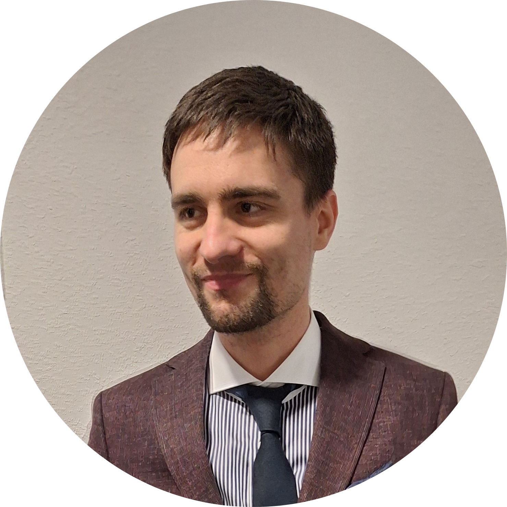

::: {.columns .v-center-container}
::: {.column width="65%"}
I am a PhD candidate in mathematics at the [University of Stuttgart](https://www.uni-stuttgart.de/), supervised by [Marco Oesting](https://www.isa.uni-stuttgart.de/institut/team/Oesting/).

I am currently finishing my PhD and looking for postdoctoral positions.

**Research interests:** extreme value theory, stochastic processes, time series, asymptotic statistics, and causality.

## Contact

Email: [ioan.scheffel@mathematik.uni-stuttgart.de](mailto:ioan.scheffel@mathematik.uni-stuttgart.de)

Affiliation: University of Stuttgart
:::

::: {.column width="35%"}
{.profile-photo}
:::
:::
